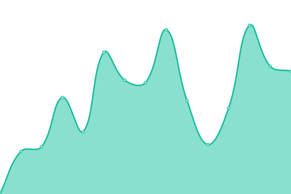
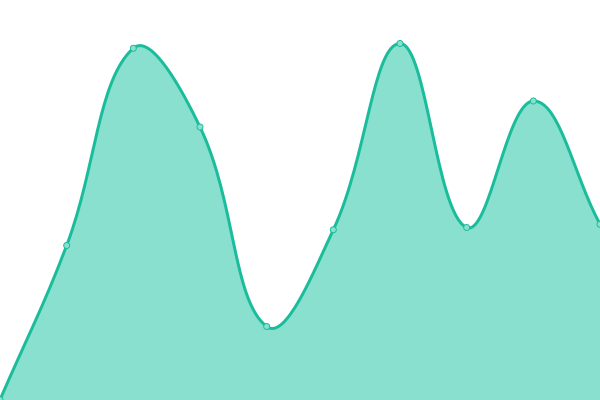
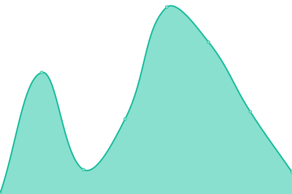

# [📈 Live Status](<[https://demo.upptime.js.org](https://uptime.vector.co.uz/)>): <!--live status--> **🟩 All systems operational**

This repository contains the open-source uptime monitor and status page for [Vector](https://demo.upptime.js.org), powered by [Upptime](https://github.com/upptime/upptime).

With [Upptime](https://upptime.js.org), you can get your own unlimited and free uptime monitor and status page, powered entirely by a GitHub repository. We use [Issues](https://github.com/vector-co-uz/uptime/issues) as incident reports, [Actions](https://github.com/vector-co-uz/uptime/actions) as uptime monitors, and [Pages](https://uptime.vector.co.uz/) for the status page.

<!--start: status pages-->
<!-- This summary is generated by Upptime (https://github.com/upptime/upptime) -->
<!-- Do not edit this manually, your changes will be overwritten -->
<!-- prettier-ignore -->
| URL | Status | History | Response Time | Uptime |
| --- | ------ | ------- | ------------- | ------ |
|  [Homeassistant](https://ha.vector.co.uz) | 🟩 Up | [homeassistant.yml](https://github.com/vector-co-uz/uptime/commits/HEAD/history/homeassistant.yml) | 

 914ms
     
 | 

<a href="https://uptime.vector.co.uz/history/homeassistant">80.66%</a>
    

|  [Frigate](https://frigate.vector.co.uz) | 🟩 Up | [frigate.yml](https://github.com/vector-co-uz/uptime/commits/HEAD/history/frigate.yml) | 

 737ms
     
 | 

<a href="https://uptime.vector.co.uz/history/frigate">80.87%</a>
    

|  [Homepage Dashboard](https://dash.vector.co.uz) | 🟩 Up | [homepage-dashboard.yml](https://github.com/vector-co-uz/uptime/commits/HEAD/history/homepage-dashboard.yml) | 

 1016ms
     
 | 

<a href="https://uptime.vector.co.uz/history/homepage-dashboard">99.56%</a>
    

|  [Links](https://links.vector.co.uz) | 🟩 Up | [links.yml](https://github.com/vector-co-uz/uptime/commits/HEAD/history/links.yml) | 

 606ms
     
 | 

<a href="https://uptime.vector.co.uz/history/links">100.00%</a>
    

<!--end: status pages-->

[**Visit our status website →**](https://uptime.vector.co.uz)
